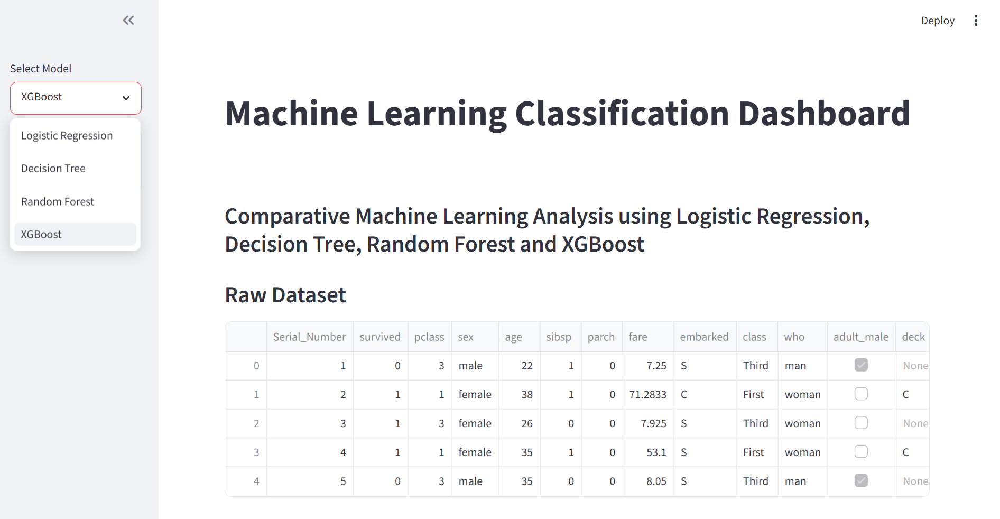
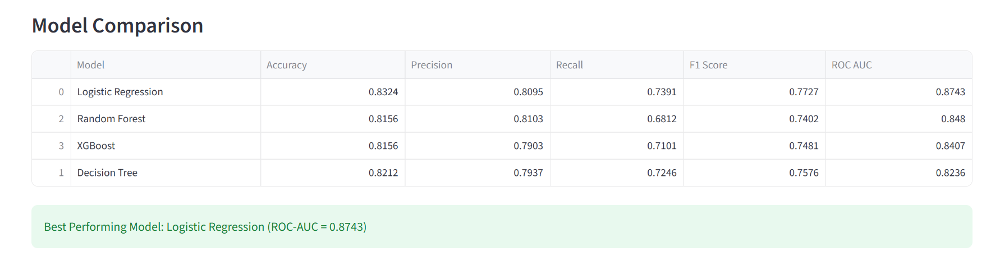
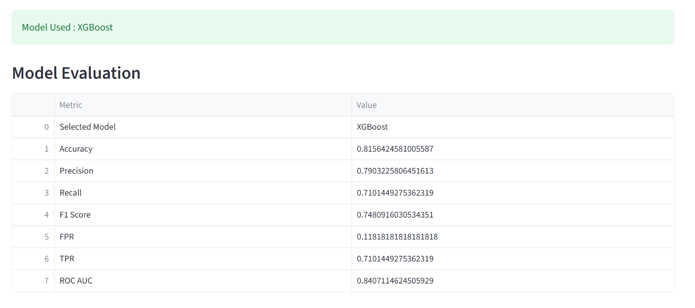
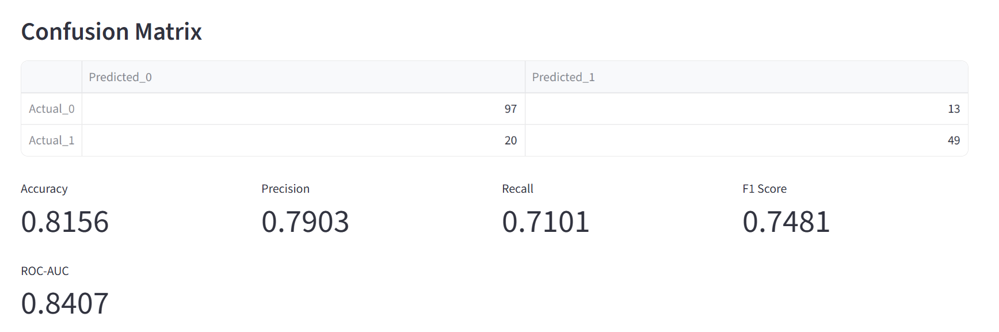
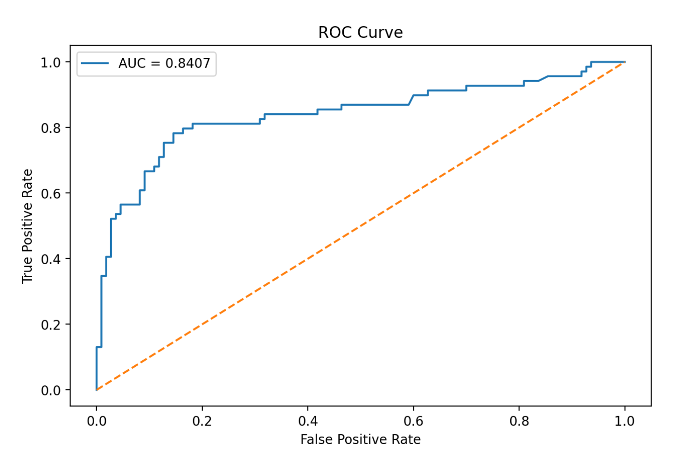
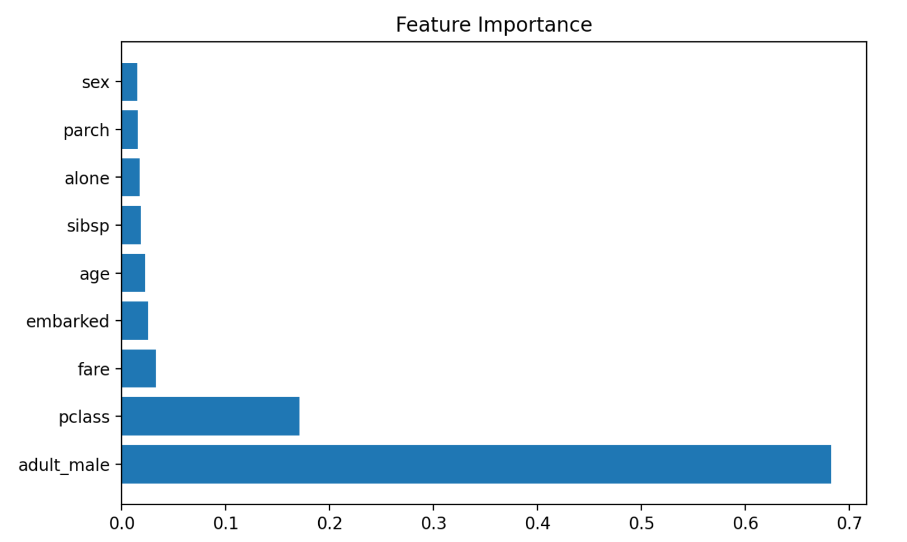
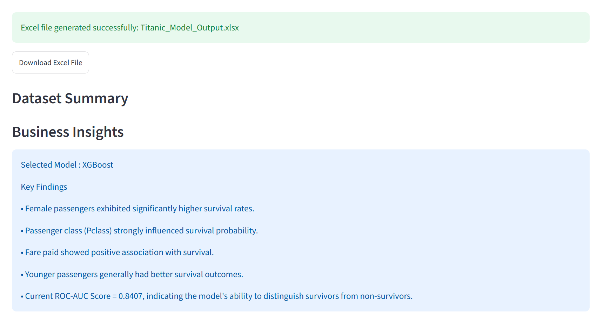

# End-to-End Machine Learning Classification Dashboard

🚀 **Live Production Deployment:** [Click Here to View the Running Application](https://ml-classification-pipeline-prototype.streamlit.app/)

A responsive, interactive web application built with **Streamlit** to perform comparative evaluation across multiple machine learning classification algorithms using a standardized tabular pipeline.

## 🎯 Project Objective
Establish a clean, reusable development framework for data ingestion, missing value imputation, categorical encoding, and multi-model performance evaluation. 

## 📸 Dashboard Interface
Here is a visual walkthrough of the functional analytics application:

### 1. Main Data Ingestion Page
*Shows the raw dataset preview alongside model framework initialization.*

### 2. Multi-Model Performance Matrix
*Enables side-by-side benchmarking of primary classification performance metrics.*

### 3. Model Evaluation Diagnostics
*Displays exact value arrays for testing evaluation parameters.*

### 4. Confusion Matrix Map
*Breaking down True Positives, False Positives, True Negatives, and False Negatives.*

### 5. Receiver Operating Characteristic (ROC) Curve
*Demonstrating the true positive rate against the false positive rate across different thresholds.*

### 6. Algorithmic Feature Importance
*Visual representation highlighting top 10 influential vectors calculated by tree-based architectures.*

### 7. Dynamic Interpretations & Deliverables
*Includes data reporting generation engines and business summaries.*

---
## 📐 Data Pipeline Architecture

The application abstracts data processing from user interface constraints using a functional pipeline layout tailored for robust classification:

1. **Ingestion Layer:** Accepts tabular file structures via an asynchronous data buffer to handle user-uploaded datasets seamlessly.
2. **Preprocessing Pipeline:** Implements structural automated imputation strategies for type-specific missing values (Median strategies for continuous distributions like Age/Fare; Mode strategies for categorical flags like Embarked).
3. **Feature Separation:** Isolates targets and constructs categorical encodings via automated target-vector alignment.
4. **Evaluation Engine:** Concurrently generates stratified performance indicators (ROC Analysis, Precision-Recall Curves, and Multi-Class Confusion Matrix layouts) across multiple models (XGBoost, Random Forest, Logistic Regression).
5. **Downstream Reporting:** Outbound transformation layer utilizing an `openpyxl` backend engine to serialize run metrics into formatted Excel reporting frameworks for business stakeholders.
   
### 💎 Key Features Implemented:
* **Multi-Model Pipeline:** Concurrent training evaluation using Logistic Regression, Decision Tree, Random Forest, and XGBoost.
* **Granular Diagnostics:** Dynamic evaluation metrics tracking Accuracy, Precision, Recall, F1 Score, and a generated False Positive Rate (FPR) / True Positive Rate (TPR) data stream.
* **Automated Excel Reporting:** Automated reporting engine compiles and formats train splits, test splits, confusion matrices, and ROC metrics into a multi-sheet downloadable Excel workbook directly to local machines using `openpyxl`.

---
## 🛠️ Tech Stack & Core Libraries
* **UI Framework:** Streamlit
* **Data Processing & Analytics:** Pandas, NumPy
* **Machine Learning Pipelines:** Scikit-Learn (Model Selection, Imputation, Metrics)
* **Gradient Boosting:** XGBoost
* **Data Visualization:** Matplotlib, Seaborn
* **Reporting Engine:** OpenPyXL (Excel Automation)

---

## 📈 Future Optimization Roadmap
To transition this prototype into a production-grade enterprise application, the next development phases will focus on:

1. **Compute Efficiency:** Wrap core model instantiation hooks within `@st.cache_resource` states to mitigate re-training cycles on UI widget adjustments.
2. **Data Leakage Safeguards:** Refactor categorical encoder scopes (`LabelEncoder`) exclusively post-train/test split boundaries to maintain operational integrity.
3. **Architecture Modularization:** Segregate decoupled scripting files into isolated `/src` component directories (`data_pipeline.py`, `model_engine.py`, `app.py`).
